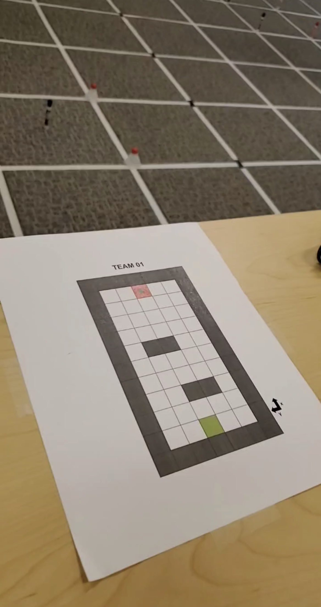
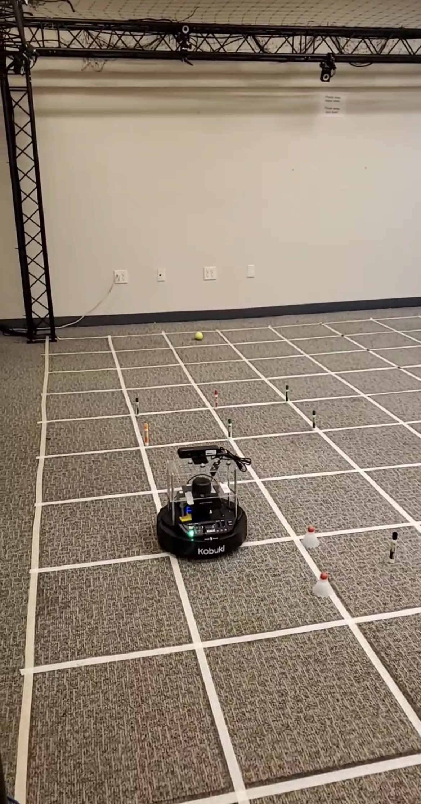

# Motion Planning & Trajectory Generation with Turtlebot3
Developed the necessary software in ROS to plan a path for the Turtlebot3 using the A* algorithm to avoid obstacles and hit the ball in the goal, and generate a trajectory using a PID controller to follow the path.

- `motion_planning.py` contains the path finding algorithm (A* Search).

- `trajectory_generation.py` contains the main function and the code for the PID controller.

  
  

